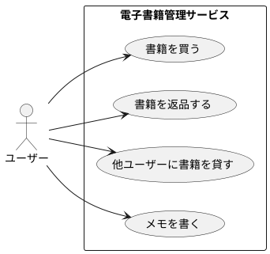
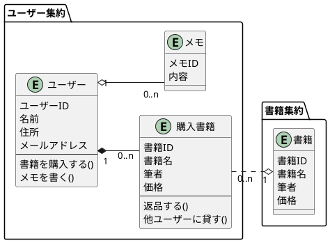
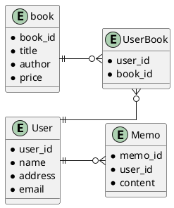
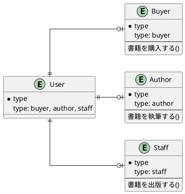

# 表現豊かな Eloquent Model で
# ドメイン知識を高凝集に保つ


<div class="absolute bottom-10">
  <span class="font-700">
    Yuki Kitaya
  </span>
</div>

---
layout: two-cols
---
# 電子書籍管理サービス



::right::
<br>
<br>

## 登場する概念

- 💁‍♂️ ユーザー
- 📕 書籍
- 📝 メモ

<br>
<br>
→ クラス図とER図を書く

---
layout: two-cols
---
# クラス図


::right::
<br>
<br>

## ドメインロジックに集中
- 現実世界に即したクラスを作る
- データベースのことは考えない(外部キーなど)

---
layout: two-cols
---
# ER 図


::right::

<br>
<br>

## データベースの都合のみを考える
- 外部キーを持つ
- 「購入書籍」クラスが、ユーザーと書籍の中間テーブルになる

---
---
# データベースとアプリケーションの密結合

- 「購入書籍」を表現するために、中間テーブルを触るケース
- アプリケーションとして自然なのは、「ユーザーが購入書籍に本を追加する」
- アプリケーションが何をしているか？理解しづらくなる

```php {all|3-9|11-14}
class PurchaseBookUseCase {
  
  public function __invoke($userId: int, $bookId: int) {
    // 何をしているのか読み取りづらい
    DB::table('userBook')->insert([
        'userId' => $user->userId,
        'bookId' => $book->bookId,  
      ]);
  }
}
```

---
---
# Eloquent as ORM
- DB を隠蔽し、インメモリなオブジェクトとして扱えるようになる
- ドメインロジックに集中できる = **DB と アプリケーションの疎結合**

```php {all|3-6}
class PurchaseBookUseCase {
  
  // 「ユーザーが購入書籍に本を追加する」をわかりやすく表現している
  public function __invoke($user: User, $bookId: int) {
    $user->books()->attach($bookId);  
  }
}
```

---
---
# Eloquent as Entity
- ドメインロジックを Eloquent に書く。メソッドを通してのみデータ制御することでカプセル化

```php {all|4-7|16-17|19-20}
class User extends Model {
  
  public function purchaseBook($book: Book): Book? {
    // ドメインバリデーション
    if($user->money < $book->price) {
      throw RuntimeException('所持金額が不足しています。');
    }
    $user->books()->attach($book->bookId);

    return $user->books()->find($book->bookId);
  }
}

class PurchaseBookUseCase($user: User, $book: Book) {
  public function __invoke(){
    // Bad: 直接データ更新すると、ドメインバリデーションをすり抜けてしまう
    $user->books()->attach($book->bookId);

    // Good: Eloquent に用意されたメソッドを介してのみデータ更新するため、データ整合性が担保される
    $user->purchaseBook($book);
  }
}
```

---
---
# モデルの肥大化

- User クラスと Book クラスのみだと、**「購入書籍」のメソッドの置き場所**に困る
- どちらか片方に寄せると、モデルが肥大化していく

```php
class User extends Model {
  public function returnBook($book: Book) {
    if($user->books()->find($book->bookId)) {
      throw ModelNotFoundException('書籍を所有していません');
    }
    
    // ドメインルールの増加につれ肥大化
    // ex. 在庫が100冊を超えている場合は返品できない
    $user->books()->detach($book->bookId);
  }
}
```

---
---
# Relationship as Entity expression
中間テーブルを「購入書籍」クラスとして解釈する

```php {all|1-9}
class PurchasedBook extends Model {
  $table = 'userBook';

  public function return() {
    // ドメインバリデーションなど
    // ex. 在庫が100冊を超えている場合は返品できない
    $this->delete();
  }
}

class User extends Model {
  
  public function purchasedBooks($bookId) {
    return $this->hasMany(PurchasedBook::class);
  }
}
```

---
---
# Eloquent をさらに柔軟に使う
- 1テーブル1クラスから、1テーブル複数クラスに増やして責務分担できる。
- スコープ・利用するリレーションを組み合わせるとさらに柔軟に
- 集約の考えと組み合わせる

```php {all|1-2|13-14}
// 書籍管理用のユーザー
class UserForBook extends Model {
  $table = 'users';

  public function purchaseBook($book: Book) {
    if($user->money < $book->price) {
      throw RuntimeException('所持金額が不足しています。');
    }
    $user->books()->attach($book->bookId);
  }
}

// メモ管理用のユーザー
class UserWriter extends Model {
  $table = 'users';

  public function writeMemo($memo: Memo) {
    $user->memos()->create($memo);
  }
}
```

---
---
# SQL アンチパターンの解消に Eloquent Model を使う
- オブジェクトの「状態」をそのままデータベースに永続化しがち
- Eloquent でタイプ別にモデルを作成して業務ロジックを閉じ込める



---
---
# まとめ

- Eloquent(ActiveRecord) = ORM + Entity
- データベースの都合を隠蔽する ORM
- ドメインロジックを高凝集に保つ Entity
- Entity のロジックを組み合わせる UseCase
- Eloquent を柔軟に構築し Entity ライクに使う
- Repository, Entity の導入